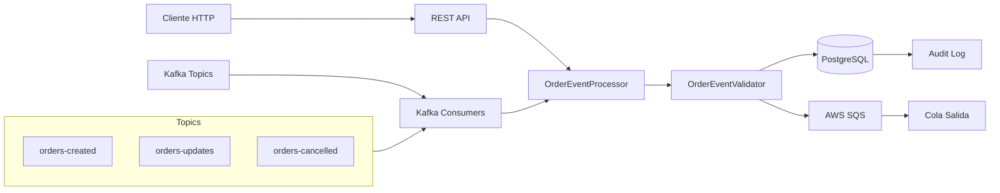

# MS-Event-Processor - Microservicio Event-Driven

[](https://openjdk.org/)
[](https://spring.io/projects/spring-boot)
[](https://kafka.apache.org/)
[](https://www.postgresql.org/)
[](https://aws.amazon.com/sqs/)
[](https://github.com/moutinho132/ms-event-processor/actions/workflows/ci.yml)
[](https://www.docker.com/)

Microservicio event-driven en Java para procesar órdenes de forma asíncrona, idempotente y reactiva, aplicando arquitectura hexagonal y patrones de microservicios modernos.

Consume eventos de órdenes desde Apache Kafka, aplica lógica de negocio, persiste en PostgreSQL y reenvía mensajes procesados a AWS SQS.

## ✨ Características principales

- **Arquitectura Event-Driven** con Apache Kafka (modo KRaft)
- **Java 21 Virtual Threads** para alto throughput con mínimo overhead
- **Idempotencia** por `orderId` - procesa mensajes duplicados sin efectos secundarios
- **Procesamiento dual**: Asíncrono (Kafka) y Síncrono (REST API)
- **Audit Trail completo** - registro de todas las operaciones
- **Retry con backoff exponencial** y Dead Letter Queue
- **Stack moderno**: Spring Boot 3.x, Spring Data JPA, Spring Security JWT

## 🏗️ Arquitectura



## 🔧 Stack técnico

| Tecnología | Versión | Propósito |
|-----------|---------|-----------|
| Java | 21 LTS | Runtime con Virtual Threads |
| Spring Boot | 3.3.5 | Framework principal |
| Spring Kafka | 3.x | Integración con Kafka |
| Spring Data JPA | 3.x | Persistencia en PostgreSQL |
| Spring Security | 3.x | Autenticación JWT |
| Apache Kafka | 3.7.0 | Message Broker (KRaft mode) |
| PostgreSQL | 15+ | Base de datos relacional |
| AWS SQS | - | Cola de mensajes de salida |
| LocalStack | 3.7 | Simulación local de AWS |
| Testcontainers | 1.20.3 | Testing de integración |

## 📁 Estructura del proyecto

```text
src/main/java/com/dev/app/
├── config/              # Configuraciones (Kafka, SQS, Security, Virtual Threads)
├── consumer/            # Kafka Consumers (3 listeners)
├── controller/          # REST API Controllers
├── dto/                 # Data Transfer Objects
├── entity/              # Entidades JPA (Order, OrderItem, OrderAudit)
├── exception/           # Manejo de excepciones
├── producer/            # SQS Producer
├── processor/           # Lógica de procesamiento
├── repository/          # Spring Data JPA Repositories
├── security/            # JWT Authentication
└── util/                # Utilidades (RetryHelper)
```

## 📋 Requisitos previos

- Java 21+
- Docker y Docker Compose
- Maven 3.9+ (o usar Maven Wrapper incluido)
- Git

## 🚀 Inicio rápido

### 1) Clonar

```bash
git clone https://github.com/moutinho132/ms-event-processor.git
cd ms-event-processor
```

### 2) Levantar infraestructura local

```bash
docker compose up -d
```

Esto iniciará:
- PostgreSQL en puerto 5432
- Apache Kafka (KRaft mode) en puerto 9092
- LocalStack (SQS) en puerto 4566

### 3) Ejecutar la aplicación

**Windows:**
```bash
mvnw.cmd spring-boot:run
```

**Linux/macOS:**
```bash
./mvnw spring-boot:run
```

API base: `http://localhost:8080`

### 4) Verificar salud de la aplicación

```bash
curl http://localhost:8080/actuator/health
```

### 5) Ejecutar tests

```bash
# Tests unitarios
./mvnw test

# Tests completos (incluye integración)
./mvnw verify
```

## 🌐 API HTTP

### Endpoints principales

Base path: `/api/v1/orders`

| Endpoint | Método | Descripción |
|----------|--------|-------------|
| `/kafka/send-test` | POST | Enviar mensaje de prueba a Kafka |
| `/kafka/send` | POST | Enviar mensaje custom a Kafka |
| `/database/check` | GET | Ver todas las órdenes en BD |
| `/database/check/{id}` | GET | Ver orden específica + auditoría |
| `/process` | POST | Procesar orden directamente (sin Kafka) |
| `/create-test` | POST | Crear orden de prueba rápidamente |
| `/{orderId}` | GET | Obtener orden por ID |
| `/` | GET | Listar órdenes (con filtros) |
| `/{orderId}/cancel` | POST | Cancelar orden |

### Enviar mensaje de prueba a Kafka

```bash
curl -X POST "http://localhost:8080/api/v1/orders/kafka/send-test"
```

### Procesar orden directamente (síncrono)

```bash
curl -X POST "http://localhost:8080/api/v1/orders/process" \
  -H "Content-Type: application/json" \
  -d '{
    "orderId": "order-001",
    "customerId": "customer-123",
    "eventType": "CREATED",
    "totalAmount": 1500.00,
    "currency": "USD",
    "items": [{
      "productId": "product-456",
      "productName": "Widget Premium",
      "quantity": 2,
      "unitPrice": 750.00
    }],
    "metadata": {
      "source": "api-test",
      "correlationId": "corr-001",
      "timestamp": "2026-07-28T22:00:00Z"
    }
  }'
```

### Verificar orden en base de datos

```bash
curl "http://localhost:8080/api/v1/orders/database/check/order-001"
```

## 📡 Apache Kafka

### Tópicos

| Tópico | Evento | Descripción |
|--------|--------|-------------|
| `orders-created` | CREATED | Nuevas órdenes creadas |
| `orders-updates` | UPDATED | Actualizaciones de órdenes |
| `orders-cancelled` | CANCELLED | Cancelaciones de órdenes |

### Configuración

- **Consumer Group**: `order-processor-group`
- **Ack Mode**: `MANUAL`
- **Offset Reset**: `earliest`
- **Max Poll Records**: 100

### Producer con script de shell

```bash
./test-producer.sh
```

## 💾 Base de datos

### Tablas principales

- `orders` - Órdenes procesadas
- `order_items` - Items de cada orden
- `order_audit_log` - Auditoría completa de operaciones

### Estados de orden

| Estado | Descripción |
|--------|-------------|
| `PENDING` | Orden creada, pendiente de procesamiento |
| `CONFIRMED` | Orden confirmada |
| `PROCESSING` | Orden en proceso |
| `SHIPPED` | Orden enviada |
| `DELIVERED` | Orden entregada |
| `CANCELLED` | Orden cancelada |
| `REFUNDED` | Orden reembolsada |

### Verificar con script

```bash
# Todas las órdenes
./check-orders.sh

# Orden específica
./check-orders.sh {order_id}
```

## 📤 AWS SQS

### Colas

- **Principal**: `ordenes-procesadas-queue`
- **Dead Letter Queue**: `ordenes-procesadas-dlq`

### Configuración LocalStack

```bash
# Crear colas manualmente
aws --endpoint-url=http://localhost:4566 \
  sqs create-queue --queue-name ordenes-procesadas-queue
```

## 🧪 Testing

### Tests unitarios

```bash
./mvnw test
```

**Cobertura actual:** 39 tests pasando

### Tests de integración

```bash
./mvnw verify
```

Utiliza Testcontainers para levantar:
- Kafka (KRaft mode)
- PostgreSQL
- LocalStack (SQS)

## 📊 Monitoreo

### Actuator Endpoints

| Endpoint | Descripción |
|----------|-------------|
| `/actuator/health` | Estado de salud |
| `/actuator/info` | Información de la aplicación |
| `/actuator/metrics` | Métricas detalladas |
| `/actuator/prometheus` | Métricas para Prometheus |

### Swagger UI

```
http://localhost:8080/swagger-ui.html
```

## 🎯 Reglas de negocio

1. **Idempotencia**: Si la orden ya existe por `orderId`, se retorna la existente
2. **Creación**: Nueva orden con estado `PENDING`
3. **Actualización**: Actualiza campos de orden existente
4. **Cancelación**: Cambia estado a `CANCELLED` y registra `cancelledAt`
5. **Auditoría**: Todas las operaciones se registran en `order_audit_log`

## 🔐 Seguridad

- **JWT Authentication**: Validación de tokens Bearer
- **Endpoints públicos**: Actuator health, Swagger UI
- **Endpoints protegidos**: API de órdenes (configurable)

## 📝 Variables de entorno

| Variable | Default | Descripción |
|----------|---------|-------------|
| `DB_HOST` | localhost | Host de PostgreSQL |
| `DB_PORT` | 5432 | Puerto de PostgreSQL |
| `DB_NAME` | orderdb | Nombre de la base de datos |
| `DB_USERNAME` | postgres | Usuario de BD |
| `DB_PASSWORD` | postgres | Password de BD |
| `KAFKA_BOOTSTRAP_SERVERS` | localhost:9092 | Bootstrap servers de Kafka |
| `AWS_SQS_ENDPOINT` | http://localhost:4566 | Endpoint de SQS |
| `JWT_SECRET` | - | Secreto para JWT |

## 🛠️ Troubleshooting

### Kafka no conecta

```bash
# Verificar estado
docker ps | grep kafka

# Ver logs
docker logs ms-event-processor-kafka

# Crear tópicos manualmente
docker exec ms-event-processor-kafka \
  /opt/kafka/bin/kafka-topics.sh \
  --create --topic orders-created \
  --bootstrap-server localhost:9092
```

### Base de datos vacía

La aplicación crea las tablas automáticamente con `ddl-auto: update`.

### LocalStack no funciona

```bash
# Verificar que está corriendo
docker ps | grep localstack

# Recrear contenedor
docker compose restart localstack
```

## 🗺️ Hoja de ruta

- [x] Consumo de eventos desde Kafka
- [x] Procesamiento idempotente
- [x] Persistencia en PostgreSQL
- [x] Reenvío a SQS
- [x] API REST para pruebas
- [x] Audit trail completo
- [x] Tests unitarios e integración
- [ ] Métricas Prometheus/Grafana
- [ ] Pipeline CI/CD con GitHub Actions
- [ ] Kubernetes deployment manifests
- [ ] Circuit breaker con Resilience4j

## 🤝 Contribución

1. Fork el repositorio
2. Crea una rama: `git checkout -b feature/mi-cambio`
3. Commit tus cambios: `git commit -m 'Agrega nueva funcionalidad'`
4. Push a la rama: `git push origin feature/mi-cambio`
5. Abre un Pull Request

## 📄 Licencia

Este proyecto está bajo la Licencia Apache 2.0 - ver el archivo [LICENSE](LICENSE) para más detalles.

## 📞 Contacto

**Autor:** Fernando Moutinho  
**GitHub:** [@moutinho132](https://github.com/moutinho132)  
**Proyecto:** [ms-event-processor](https://github.com/moutinho132/ms-event-processor)

---

**Hecho con ❤️ usando Java 21 y Spring Boot**
